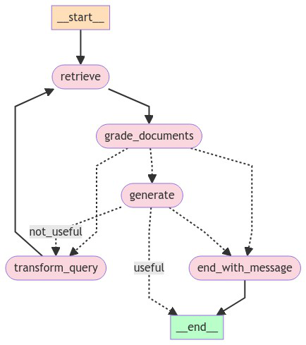

<p align="center">
    <h1 align="center">CHAT-DOCUMENTS</h1>
</p>
<p align="center">
    <em>Chat with your documents using LangChain and Chainlit.</em>
</p>

## Features

### Self-RAG



## Repository Structure

```sh
└── chat-documents/
    ├── app.py
    ├── components
    │   ├── chainlit
    │   ├── chains.py
    │   ├── document_loader.py
    │   ├── index_builder.py
    │   ├── rag_workflow.py
    │   └── schemas.py
    └── resources
```
